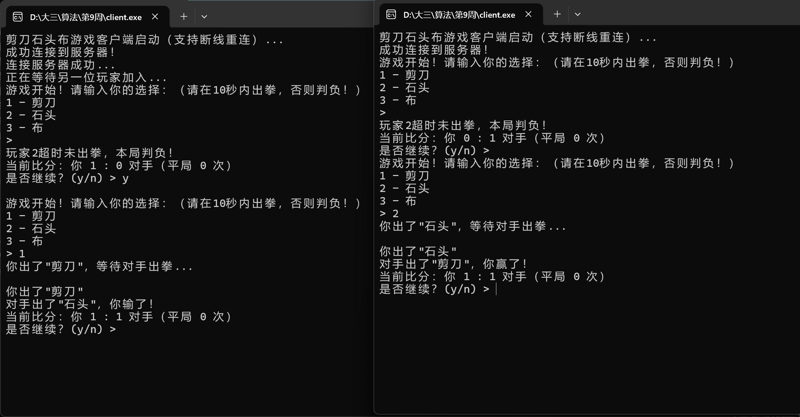
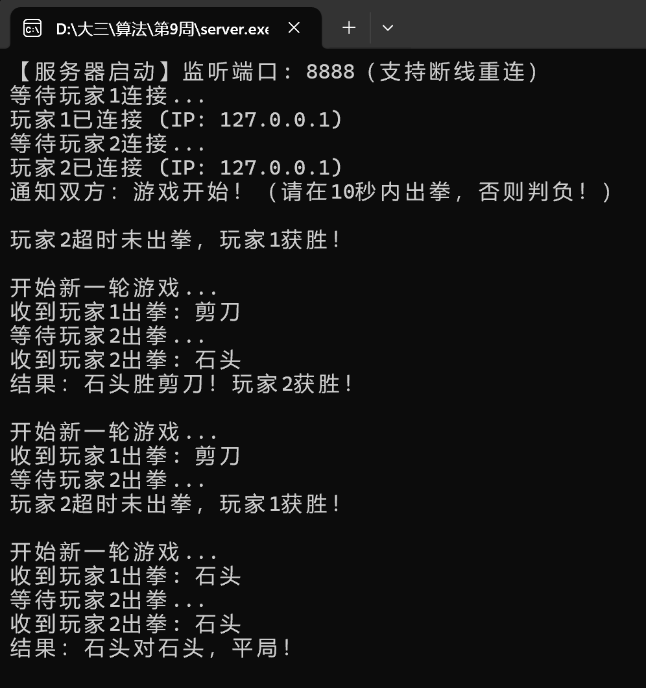
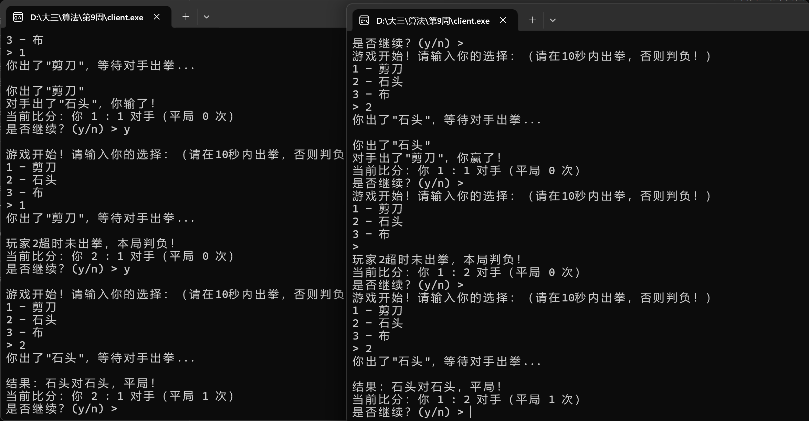

# 剪刀石头布网络对战游戏

基于TCP Socket实现的剪刀石头布双人对战游戏，支持多轮对战、比分统计、超时判负和断线重连功能。

## 编译方法

### Windows平台（使用GCC）

```bash
# 编译服务器
gcc server.c -o server.exe -lws2_32

# 编译客户端
gcc client.c -o client.exe -lws2_32
```

### Linux平台

```bash
# 编译服务器
gcc server.c -o server -pthread

# 编译客户端
gcc client.c -o client -pthread
```

如果使用Visual Studio 2022，可以参考 `编译指南.md` 文件。

## 运行方法

1. 先启动服务器（在一个终端窗口）：
   ```bash
   server.exe    # Windows
   ./server      # Linux
   ```

2. 再启动两个客户端（分别在两个终端窗口）：
   ```bash
   client.exe    # Windows
   ./client      # Linux
   ```

3. 游戏流程：
   - 两个客户端都连接后，游戏自动开始
   - 输入 1（剪刀）、2（石头）或 3（布）
   - 双方都出拳后显示结果和比分
   - 输入 y 继续下一轮，输入 n 退出

## 主要功能

- **TCP Socket通信**：使用TCP协议保证可靠传输
- **多线程处理**：服务器为每个玩家创建独立线程，客户端使用接收线程处理消息
- **同步机制**：使用互斥锁保护共享资源，确保线程安全
- **多轮游戏**：支持连续多轮对战，自动统计比分
- **超时判负**：每轮游戏开始后10秒内未出拳自动判负
- **断线重连**：玩家断线后可以自动重连，服务器会恢复游戏状态

## 技术实现

### 服务器端

- 使用 `socket`、`bind`、`listen`、`accept` 建立TCP连接
- 为每个玩家创建 `handle_player_thread` 线程处理消息
- 创建 `timeout_thread` 线程检测超时
- 使用 `CRITICAL_SECTION`（Windows）或 `pthread_mutex`（Linux）实现线程同步
- 维护游戏状态：比分、出拳选择、连接状态等

### 客户端

- 使用 `socket`、`connect` 连接服务器
- 创建 `receive_thread` 线程持续接收服务器消息
- 主线程负责发送用户输入
- 自动检测断线并尝试重连（最多5次，每次间隔3秒）

### 跨平台支持

代码使用 `#ifdef _WIN32` 条件编译，自动适配Windows和Linux平台：
- Windows：使用 Winsock2 API 和 Windows线程API
- Linux：使用 POSIX Socket API 和 pthread库

## 游戏规则

- 1 = 剪刀
- 2 = 石头  
- 3 = 布

胜负关系：石头 > 剪刀，剪刀 > 布，布 > 石头

## 注意事项

- 服务器默认监听端口 8888，可在代码中修改 `PORT` 宏
- 客户端默认连接 `127.0.0.1:8888`，可在代码中修改 `SERVER_IP` 宏
- 超时时间默认为10秒，可在服务器代码中修改 `TIMEOUT_SECONDS` 宏
- 如果遇到中文乱码，确保控制台编码为UTF-8（代码已自动设置）

## 使用的技术点简述

- **多线程**：服务器为每个玩家创建独立线程处理消息，客户端使用接收线程持续接收服务器消息
- **阻塞接收**：客户端使用 `recv()` 阻塞接收服务器消息，主线程负责发送用户输入
- **线程同步**：使用互斥锁（`CRITICAL_SECTION`/`pthread_mutex`）保护共享资源，确保线程安全
- **TCP Socket**：使用TCP协议保证可靠传输，服务器监听端口，客户端连接服务器
- **状态管理**：服务器维护游戏状态（比分、出拳选择、连接状态），支持断线重连和状态恢复

## 截图：展示一次完整对战过程

截图包含：
- 服务器启动和玩家连接信息


- 玩家出拳选择过程

- 游戏结果和比分显示



- 多轮游戏继续过程



- 超时判负


- 断线重连


注意：该程序断线重连有两种情况：
1.服务器断连，玩家1与玩家2等待5次重连尝试（每次等待3秒），若服务器重连成功，游戏重新开始，得分归零；
2.玩家断连，玩家断连若超过10秒后重连成功，根据超时判负机制会宣布本轮该玩家判负，游戏继续进行，得分不变。


## 文件说明

- `server.c` - 服务器源码
- `client.c` - 客户端源码


## 关于评分细则

服务器能正常监听和接受连接	15 分	socket/bind/listen/accept 正确
客户端能成功连接服务器	10 分	connect 成功
支持两个客户端连接并交互	20 分	服务器能管理两个连接
出拳同步与胜负判断正确	20 分	不允许提前泄露对方选择
多轮游戏支持 + 比分统计	10 分	可重复玩多局
使用多线程或多进程处理并发	15 分	必须有并发控制
代码规范 + 注释清晰 + README 完整	10 分	可读性强
附加分：加入超时机制（如某方不出拳则此局判负），并实现断线重连机制

注意：
超时判负时间为10秒，可自行改动；
该程序断线重连有两种情况：
1.服务器断连，玩家1与玩家2等待5次重连尝试（每次等待3秒），若服务器重连成功，游戏重新开始，得分归零；
2.玩家断连，玩家断连若超过10秒后重连成功，根据超时判负机制会宣布本轮该玩家判负，游戏继续进行，得分不变。

以上评分细则的要求均已实现。


