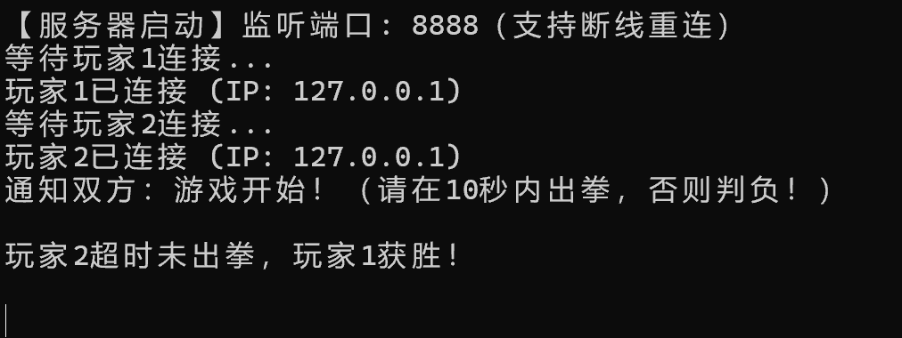
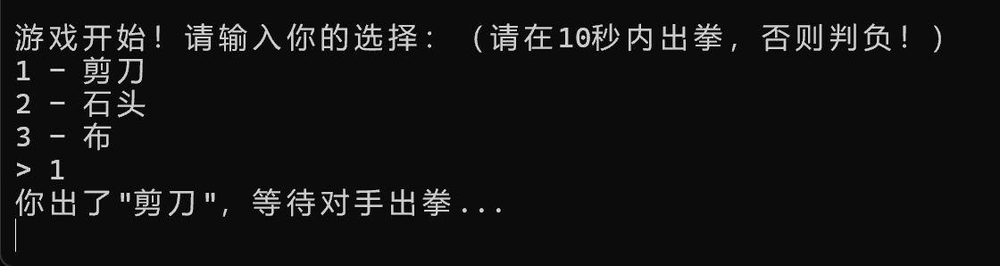
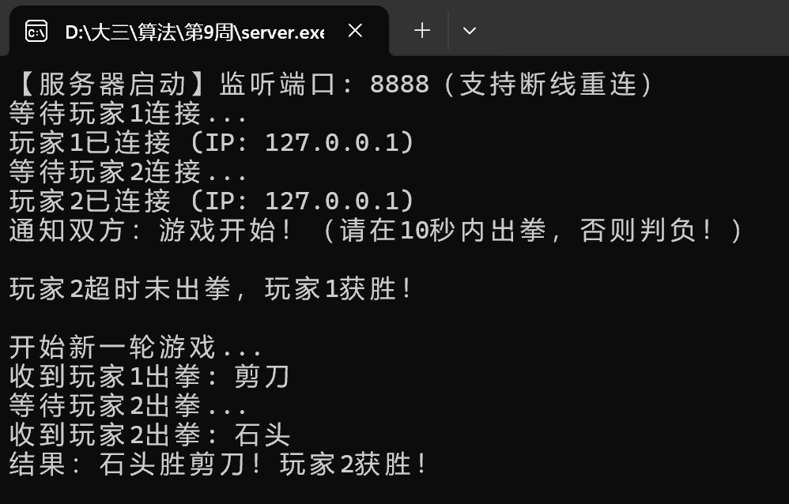
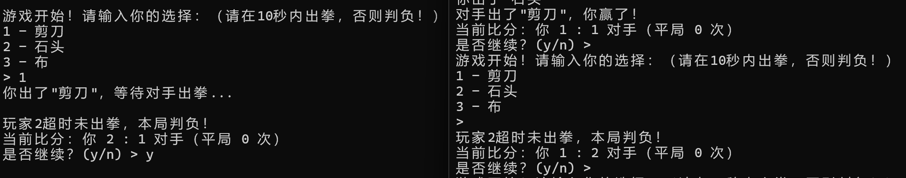
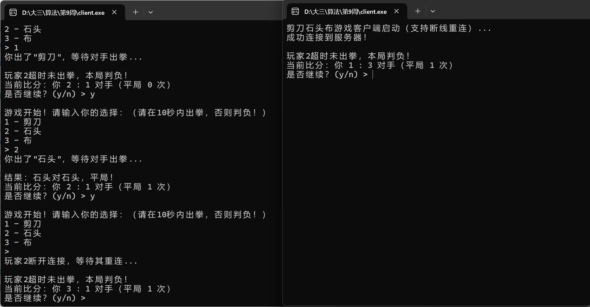

# TCP Rock Paper Scissors

[中文说明](README.zh-CN.md)

A two-player command-line Rock Paper Scissors game implemented in C with TCP sockets and multithreading. The server coordinates simultaneous moves, tracks scores across rounds, applies a 10-second timeout, and supports reconnection handling.

## Highlights

- Two-player networking over TCP
- Concurrent connection handling with threads
- Protected shared game state using mutexes
- Multi-round score tracking
- Timeout loss when a player does not move within 10 seconds
- Reconnection and state-recovery logic
- Windows and Unix socket abstractions

## Architecture

```text
┌──────────┐        TCP        ┌──────────────┐        TCP        ┌──────────┐
│ Player 1 │ ◀───────────────▶ │ Game server  │ ◀───────────────▶ │ Player 2 │
│  client  │                   │ port 8888    │                   │  client  │
└──────────┘                   └──────────────┘                   └──────────┘
                                      │
                         moves, timeout, score and
                           connection-state logic
```

The server creates a worker thread for each player and a separate timeout-monitoring thread. A mutex protects choices, scores and connection state shared by those threads.

## Repository status

The repository currently contains the server source and a prebuilt Windows client. The original `client.c` source was not included in the repository history, so the executable is temporarily retained to keep the project runnable on Windows. Restoring the client source is the next priority.

## Build

### Unix-like systems

Build the server with:

```bash
make
```

or directly:

```bash
cc -Wall -Wextra -pthread server.c -o server
```

### Windows

With MinGW GCC:

```powershell
gcc server.c -o server.exe -lws2_32
```

See [BUILDING.md](BUILDING.md) for details.

## Run

1. Start the server:

   ```bash
   ./server
   ```

   On Windows, run `server.exe`.

2. Start two client instances. At present, the repository provides `client.exe` for Windows.

3. Enter a move when prompted:

   - `1` — Scissors
   - `2` — Rock
   - `3` — Paper

4. Enter `y` to play another round or `n` to exit.

By default, the server listens on TCP port `8888`, and the client connects to `127.0.0.1:8888`.

## Screenshots

### Server startup and player connections



### Player choices



### Round result and score



### Timeout handling



### Reconnection



## Project layout

```text
.
├── server.c
├── client.exe
├── Makefile
├── BUILDING.md
├── README.md
├── README.zh-CN.md
├── docs/
│   └── assignment-requirements.zh-CN.md
└── images/
```

## Configuration

The primary settings are compile-time constants in the source:

- `PORT` — server port, default `8888`
- `BUFFER_SIZE` — network buffer size
- `TIMEOUT_SECONDS` — move timeout, default 10 seconds
- `SERVER_IP` — client target address when the client source is restored

## Known limitations

- The client source is currently missing.
- The included client binary is Windows-only.
- The protocol uses plain text messages and has no authentication or encryption.
- The server is designed for one two-player match at a time.

## License

This project is licensed under the [MIT License](LICENSE).
